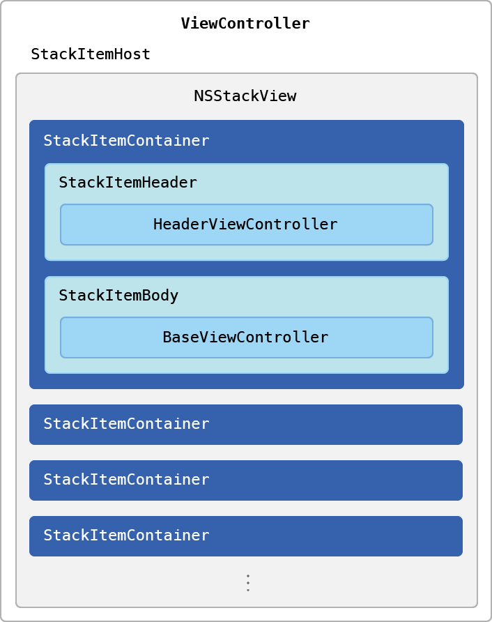

# Organize Your User Interface with a Stack View

Group individual views in your app's user interface into a scrollable stack view.

## Overview

[`NSStackView`](https://developer.apple.com/documentation/appkit/nsstackview) simplifies the process of stacking arbitrary views together in one place. You embed a stack view inside an `NSScrollView` object, making the stack's content scrollable when the user resizes the window. This sample shows how to use `NSStackView` with each individual view either disclosed (expanded) or hidden (collapsed).

The sample's architecture uses the following protocols:
* `StackItemHeader`. Represents the header's view and its ability to expand and collapse its corresponding stack item body.
* `StackItemBody`. Represents the stack item's primary interface.
* `StackItemContainer`. Represents each stack item, combining both the header view and the body view.
* `StackItemHost`. Discloses each stack item container.

The following code shows the `StackItemContainer` class and its associated header and body components:

``` swift
class StackItemContainer {
    // Disclosure state of this container.
    var state: NSControl.StateValue
    
    let header: StackItemHeader
    let body: StackItemBody
    
    init(header: StackItemHeader, body: StackItemBody) {
        self.header = header
        self.body = body
        self.state = .on
    }
```
[View in Source](x-source-tag://Container)

This design simplifies adding stack items as view controllers. When you adopt these protocols, all stack items behave the same way and follow the same management rules.

The following illustration shows an example stack view:



## Configure the Sample Code Project

In Xcode, choose your development team on the macOS target's General tab.

## Configure the System

This sample uses window state restoration so that when the app is relaunched, the user interface returns to the state the user left it in. For state restoration to work, you must deselect the "Close windows when quitting an app" checkbox on the General Pane in System Preferences. To reset state restoration, use Command-Option-Quit when quitting the sample.

## Configure the Stack View

Each stack item's header and body view controllers are loaded from a storyboard and added to the stack view in the `addViewController()` setup function:

``` swift
/// Used to add a particular view controller as an item to the stack view.
private func addViewController(withIdentifier identifier: String) {
    let storyboard = NSStoryboard(name: "StackItems", bundle: nil)
    guard let viewController =
        storyboard.instantiateController(withIdentifier: identifier) as? BaseViewController else { return }

    // Set up the view controller's item container.
    let stackItemContainer = viewController.stackItemContainer!
    
    // Set the appropriate action function for toggling the disclosure state of each header.
    stackItemContainer.header.disclose = {
     	self.disclose(viewController.stackItemContainer!)
    }
    
    // Add the header view.
    stackView.addArrangedSubview(stackItemContainer.header.viewController.view)
    
    // Add the main body content view.
    stackView.addArrangedSubview(stackItemContainer.body.viewController.view)

    // Set the default disclosure states (state restoration may restore them to their requested value).
	show(stackItemContainer, animated: false)
}
```
[View in Source](x-source-tag://Configure)

## Restore the User Interface

To restore the stack view's window on relaunch, use the [`NSWindowRestoration`](https://developer.apple.com/documentation/appkit/nswindowrestoration) protocol. The disclosure states of all stack view containers are also restored. Each body view controller saves and restores various parts of its user interface.

To restore the states of stack view items, add the `NSRestorableState` to each item's view controller:

* `FormViewController`. Restores the form field text content.
* `TableViewController`. Restores the table view's selection.
* `CollectionViewController`. Restores the collection view's selection.

For `FormViewController`, restoration looks like this:

``` swift
/// Encode state. Helps save the restorable state of this view controller.
override func encodeRestorableState(with coder: NSCoder) {
    
    coder.encode(textField.stringValue, forKey: FormViewController.formTextKey)
    super.encodeRestorableState(with: coder)
}

/// Decode state. Helps restore any previously stored state.
override func restoreState(with coder: NSCoder) {
    
    super.restoreState(with: coder)
    if let restoredText = coder.decodeObject(forKey: FormViewController.formTextKey) as? String {
        textField.stringValue = restoredText
    }
}
```
[View in Source](x-source-tag://FormRestoration)

## Choose a Disclosure Appearance

This sample provides two disclosure options:
* A triangle
* A rounded button

The sample project conditionally decides which type of header disclosure control to use by referencing the `DisclosureTriangleAppearance` compilation flag. This flag is predefined in the “Active Compilation Conditions” build settings for passing conditional compilation flags to the Swift compiler. For more about configuring Xcode build settings, see [Xcode Help](https://help.apple.com/xcode/mac/current/#/dev04b3a04ba).

If a disclosure appearance is defined, each section in the stack view gets the `NSButton` disclosure style (a triangle). If you prefer the `roundedDisclosure` style (a rounded button with up and down arrows), remove the compilation flag from the Xcode target's build settings.

