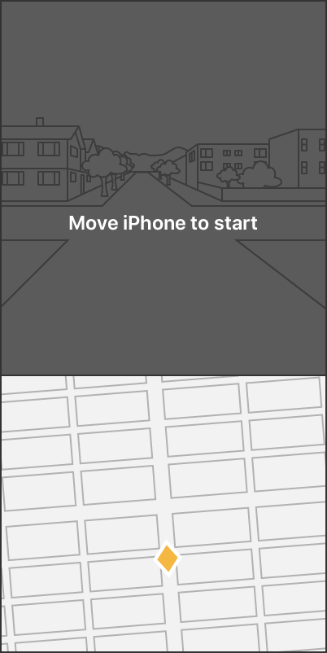

# Tracking Geographic Locations in AR

Track specific geographic areas of interest and render them in an AR experience.

## Overview

In this sample app, the user marks spots on a map or camera feed to create a collection of anchors they view in augmented reality (AR). By rendering those anchors as virtual content in an AR view, the user can see a nearby anchor through the camera feed, move to its physical location, and continue to move to any subsequent anchors in the collection. If a virtual anchor that the user is moving toward isn't visible in the camera feed, the user can refer to its pin in the map view and advance until the virtual anchor becomes visible.

Geotracking configuration ([`ARGeoTrackingConfiguration`][1]) combines GPS, the device's compass, and world-tracking features in AR to track specific geographic locations. By giving ARKit a latitude and longitude (and optionally, altitude), the sample app declares interest in a specific location on the map. 

During a geotracking session, ARKit marks this location in the form of a *location anchor* ([`ARGeoAnchor`][2]) and continually refines its position in the camera feed as the user moves about. ARKit provides the location anchor's coordinates with respect to the scene, which allows the app to render virtual content at its real-world location or trigger other interactions. 

For example, when the user approaches a location anchor, an app may reveal a virtual signpost that explains a historic event that occurred there. Or, to form a street route, an app could render a virtual anchor in a series of location anchors that connect.


- Note: ARKit supports geotracking only with the device's rear camera. 

## Ensure Device Support

Geotracking requires an iOS/iPadOS 14 device with A12 Bionic chip or later, and cellular (GPS) capability. At the application entry point (see the sample project's `AppDelegate.swift`), the sample app prevents running an unsupported configuration by checking whether the device supports geotracking.

``` swift
if !ARGeoTrackingConfiguration.isSupported {
    let storyboard = UIStoryboard(name: "Main", bundle: nil)
    window?.rootViewController = storyboard.instantiateViewController(withIdentifier: "unsupportedDeviceMessage")
}
```

If the device doesn't support geotracking, the sample project will stop. Optionally, the app presents the user with an error message and continues the experience at a limited capacity without geotracking.

## Display an AR View and Map View

As an AR app, the sample project renders location anchors using an [`ARView`][3]. To reinforce the correspondence between geographic locations and positions in the session's local space, the sample project also displays a map view ([`MKMapView`][4]) that marks the anchors from a top-down perspective. The app displays both views simultaneously by using a stack view ([`UIStackView`][5]) with the camera feed on top. See the sample's `View Controller Scene` within the project's `Main.storyboard`.

## Check Availability and Run a Session

To place location anchors with precision, geotracking requires a better understanding of the user’s geographic location than is possible with GPS alone. Based on a particular GPS coordinate, ARKit downloads batches of imagery that depict the physical environment in that area and assist the session with determining the user’s precise geographic location.

This *localization imagery* captures the view mostly from public streets and routes accessible by car. As a result, geotracking doesn’t support areas within the city that are gated or accessible only to pedestrians, as ARKit lacks localization imagery there.

Because localization imagery depicts specific regions on the map, geotracking only supports areas where Apple has collected localization imagery in advance. Before starting a session, the sample project checks whether geotracking supports the user's location by calling [`checkAvailability(completionHandler:)`][6].

``` swift
ARGeoTrackingConfiguration.checkAvailability { (available, error) in
    if !available {
        let errorDescription = error?.localizedDescription ?? ""
        let recommendation = "Please try again in an area where geotracking is supported."
        let restartSession = UIAlertAction(title: "Restart Session", style: .default) { (_) in
            self.restartSession()
        }
        self.alertUser(withTitle: "Geotracking unavailable",
                       message: "\(errorDescription)\n\(recommendation)",
                       actions: [restartSession])
    }
}
```

ARKit requires a network connection to download localization imagery. The [`checkAvailability`][6] function will return `false` if a network connection is unavailable. If geotracking is available, the sample project runs a session.

``` swift
let geoTrackingConfig = ARGeoTrackingConfiguration()
geoTrackingConfig.planeDetection = [.horizontal]
arView.session.run(geoTrackingConfig)
```

- Note: If geotracking is unavailable in the user's current location, an app can suggest an alternative area if [`checkAvailability(at:completionHandler:)`][7] returns `true` for a nearby location.

## Coach the User as the Session Begins

To begin a geotracking session, the framework undergoes a process composed of several geotracking states. To monitor these state changes, the sample project implements the [`session:didChangeGeoTrackingStatus:`][8] callback.

``` swift
func session(_ session: ARSession, didChange geoTrackingStatus: ARGeoTrackingStatus) {
```

When the app first launches, the geotracking status is [`initializing`][22] as the framework ensures the device's location meets geotracking requirements. The session acquires a confident GPS position for the user ([`waitingForLocation`][13]), checks availability at the user's location ([`waitingForAvailabilityCheck`][23]), and downloads localization imagery ([`geoDataNotLoaded`][10]). 

Each phase in the initialization process requires coordination with the user. The sample app implements a geotracking coaching overlay in the `GeoCoachingViewController.swift` file that spans several user instructions. To display user instructions, the coaching overlay calls [`setText`](x-source-tag://SetText).

``` swift
private func setText(text: String?) {
    
    if let unwrappedText = text {
        DispatchQueue.main.async() {
            self.setActive(true)
            self.coachingText.text = unwrappedText
```

The overlay displays its first user message as the session initializes. The world-tracking subsystem requires the device to move so it can also initialize. The coaching experience guides the user to move the device. 



To bring attention to this textual guidance, the overlay dims the camera feed by adding a transparent black background. 

``` swift
private func initializeBackgroundView() {
    
    background.translatesAutoresizingMaskIntoConstraints = false
    coachingParentView.addSubview(background)
    background.fillParentView()
    background.backgroundColor = UIColor(red: 0, green: 0, blue: 0, alpha: arCoachingBackgroundOpacity)
```

After the session downloads localization imagery, the geotracking state becomes [`localizing`][12] and the user holds the camera up to capture the view from the street. During this time, ARKit compares the camera's imagery to the localization imagery. When the two match, the framework can align the user's precise geographic location with the scene's local coordinates. For more information, see [`ARGeoTrackingConfiguration`][1]. 


If the camera isn't capturing the images ARKit needs, such as if the user points the camera downward, the geotracking status reason becomes [`devicePointedTooLow`][24]. The coaching experience asks the user to raise the device.


The localization process may run long if objects, such as cars or trees, block the camera's view. The geotracking state reason becomes [`visualLocalizationFailed`][25] and the experience coaches the user around visual obstructions. 


When ARKit succeeds in matching localization imagery with captures from the camera, the geotracking state moves to [`localized'][11] and the app is free to create location anchors. 

The coaching experience checks for the [`localized`][11] state within the coaching view's update function.

``` swift
if self.coachingState != .localized {
    self.transitionToLocalizingState()
```

If the geotracking state is [`localized`][11], the coaching experience ends. 

``` swift
private func transitionToLocalizedState() {
    
    coachingState = .localized
    setActive(false)
```

When the app calls `setActive` with an argument of `false`, the coaching parent view sets [`isHidden`][26] to `true`.

``` swift
DispatchQueue.main.asyncAfter(deadline: .now() + arCoachingFadeDuration) {
    coachingParentView.isHidden = true
```

To transition in and out of the coaching experience smoothly, the `setActive` function runs a fade animation using the [`alpha`][31] view property. As a result, the coaching experience ends by fading to transparent, revealing the [`ARView`][3]. 

``` swift
UIView.animate(withDuration: arCoachingFadeDuration, delay: 0, options: .beginFromCurrentState, animations: {
    coachingParentView.alpha = canBeActivated ? 1 : 0
```

## Coach the User as the Session Runs

After the app has localized and begun a geotracking session, the sample app monitors geotracking state changes and displays any important information in an onscreen label. 

``` swift
self.trackingStateLabel.text = text
```

As the user moves along a street, the framework continues to download localization imagery as needed to maintain a precise understanding of the user's position in the world. If the [`.geoDataNotLoaded`][10] state reason occurs after the session localized, it may indicate a network issue arose. If this state reason persists for some time, an app may ask the user to check the internet connection.

While the session is running, it’s possible for the user to cross into an area where geotracking is unavailable. In this case, ARKit provides the status reason [`notAvailableAtLocation`][9]. To enable the session to continue, the sample project presents text to guide the user accordingly.

``` swift
case .notAvailableAtLocation: return "Geotracking is unavailable here. Please return to your previous location to continue"
```

## Coach the User for World-Tracking Status

Because a geotracking session maps the geographic coordinate space to ARKit's world-tracking local space, the app requires basic world-tracking support. Maintaining a world-tracking session requires coordination with the user when the world-tracking status declines. To detect and correct this situation, the sample app uses [ARCoachingOverlayView][29]. 

``` swift
func setupWorldTrackingCoachingOverlay() {
    coachingOverlayWorldTracking.delegate = self
    arView.addSubview(coachingOverlayWorldTracking)
```

For example, if an object obscures the camera, ARKit's ability to model the physical environment is impacted. The world-tracking status moves to [limited][27] with reason [insufficientFeatures][28]. The coaching overlay detects this status change and displays text asking the user to move the device. When the camera's view becomes unobstructed again, the world-tracking status returns to [normal][30] and the coaching experience ends.

## Create an Anchor When the User Taps the Map

The sample project acquires the user's geographic coordinate (`CLLocationCoordinate2D`) from the map view at the screen location where the user tapped.

``` swift
func handleTapOnMapView(_ sender: UITapGestureRecognizer) {
    let point = sender.location(in: mapView)
    let location = mapView.convert(point, toCoordinateFrom: mapView)
```

With the user's latitude and longitude, the sample project creates a location anchor. 

``` swift
geoAnchor = ARGeoAnchor(coordinate: location)
```

Because the map view returns a 2D coordinate with no altitude, the sample calls [`init(coordinate:)`][19], which defaults the location anchor's altitude to ground level.

To begin tracking the anchor, the sample project adds it to the session.

``` swift
arView.session.add(anchor: geoAnchor)
```

The sample project listens for the location anchor in [`session(didAdd:)`][18] and visualizes it in AR by adding a placemark entity to the scene.

``` swift
func session(_ session: ARSession, didAdd anchors: [ARAnchor]) {
    for geoAnchor in anchors.compactMap({ $0 as? ARGeoAnchor }) {
        // Effect a spatial-based delay to avoid blocking the main thread.
        DispatchQueue.main.asyncAfter(deadline: .now() + (distanceFromDevice(geoAnchor.coordinate) / 10)) {
            // Add an AR placemark visualization for the geo anchor.
            self.arView.scene.addAnchor(Entity.placemarkEntity(for: geoAnchor))
```

To establish visual correspondence in the map view, the sample project adds an [`MKOverlay`][17] that represents the anchor on the map.

``` swift
let anchorIndicator = AnchorIndicator(center: geoAnchor.coordinate)
self.mapView.addOverlay(anchorIndicator)
```

## Create an Anchor When the User Taps the AR View

When the user taps the camera feed, the sample project casts a ray at the screen-tap location to determine its intersection with a real-world surface. 

``` swift
if let result = arView.raycast(from: point, allowing: .estimatedPlane, alignment: .any).first {
```

The raycast result's translation describes the intersection's position in ARKit's local coordinate space. To convert that point to a geographic location, the sample project calls the session-provided utility [`getGeoLocation(forPoint:)`][16].

``` swift
arView.session.getGeoLocation(forPoint: worldPosition) { (location, altitude, error) in
```

Then, the sample project creates a location anchor with the result. Because the result includes altitude, the sample project calls the [`init(coordinate:altitude:)`][20] anchor initializer.

- Note: For more on raycasting, see [raycasting collection][32].

## Assess Geotracking Accuracy

To ensure the best possible user experience, an app must monitor and react to the geotracking [`accuracy`][14]. When possible, the sample project displays the accuracy as part of its state messaging to the user. The session populates accuracy in its [`geoTrackingStatus`][21] in state [`.localized`][11].

``` swift
if geoTrackingStatus.state == .localized {
    text += "Accuracy: \(geoTrackingStatus.accuracy.description)"
```

An app renders location anchors using an asset that’s less exact if geotracking is off by a small distance, such as when accuracy is [`.low`][15]. For example, the sample app renders a location anchor as a large ball several meters in the air rather than an arrow that rests its point on a real-world surface. 

## Center the Map as the User Moves

The sample project uses updates from [Core Location][33] to center the user in the map view. When the user moves around, Core Location notifies the delegate of any updates in geographic position. The sample project monitors this event by implementing the relevant callback.

``` swift
func locationManager(_ manager: CLLocationManager, didUpdateLocations locations: [CLLocation]) {
```

When the user's position changes, the sample project pans the map to center the user.

``` swift
let camera = MKMapCamera(lookingAtCenter: location.coordinate,
                         fromDistance: CLLocationDistance(250),
                         pitch: 0,
                         heading: mapView.camera.heading)
mapView.setCamera(camera, animated: false)
```

[1]:https://developer.apple.com/documentation/arkit/argeotrackingconfiguration
[2]:https://developer.apple.com/documentation/arkit/argeoanchor
[3]:https://developer.apple.com/documentation/realitykit/arview
[4]:https://developer.apple.com/documentation/mapkit/mkmapview
[5]:https://developer.apple.com/documentation/uikit/uistackview
[6]:https://developer.apple.com/documentation/arkit/argeotrackingconfiguration/3571351-checkavailability
[7]:https://developer.apple.com/documentation/arkit/argeotrackingconfiguration/3571350-checkavailability
[8]:https://developer.apple.com/documentation/arkit/arsessionobserver/3580878-session
[9]:https://developer.apple.com/documentation/arkit/argeotrackingstatus/statereason/notavailableatlocation
[10]:https://developer.apple.com/documentation/arkit/argeotrackingstatus/statereason/geodatanotloaded
[11]:https://developer.apple.com/documentation/arkit/arframe/state/localized
[12]:https://developer.apple.com/documentation/arkit/arframe/state/localizing
[13]:https://developer.apple.com/documentation/arkit/argeotrackingstatus/statereason/waitingforlocation
[14]:https://developer.apple.com/documentation/arkit/argeotrackingstatus/3580875-accuracy
[15]:https://developer.apple.com/documentation/arkit/argeotrackingstatus/accuracy/low
[16]:https://developer.apple.com/documentation/arkit/arsession/3571352-getgeolocation
[17]:https://developer.apple.com/documentation/mapkit/mkoverlay
[18]:https://developer.apple.com/documentation/arkit/arsessiondelegate/2865617-session
[19]:https://developer.apple.com/documentation/arkit/argeoanchor/3551718-initwithcoordinate
[20]:https://developer.apple.com/documentation/arkit/argeoanchor/3551719-initwithcoordinate
[21]:https://developer.apple.com/documentation/arkit/arframe/3580861-geotrackingstatus
[22]:https://developer.apple.com/documentation/arkit/arframe/state/initializing
[23]:https://developer.apple.com/documentation/arkit/argeotrackingstatus/statereason/waitingforavailabilitycheck
[24]:https://developer.apple.com/documentation/arkit/argeotrackingstatus/statereason/devicepointedtoolow
[25]:https://developer.apple.com/documentation/arkit/argeotrackingstatus/statereason/visuallocalizationfailed
[26]:https://developer.apple.com/documentation/uikit/uiview/1622585-ishidden
[27]:https://developer.apple.com/documentation/arkit/arcamera/trackingstate/limited
[28]:https://developer.apple.com/documentation/arkit/arcamera/trackingstate/reason/insufficientfeatures
[29]:https://developer.apple.com/documentation/arkit/arcoachingoverlayview
[30]:https://developer.apple.com/documentation/arkit/arcamera/trackingstate/normal
[31]:https://developer.apple.com/documentation/uikit/uiview/1622417-alpha
[32]:https://developer.apple.com/documentation/arkit/environmental_analysis
[33]:https://developer.apple.com/documentation/corelocation
